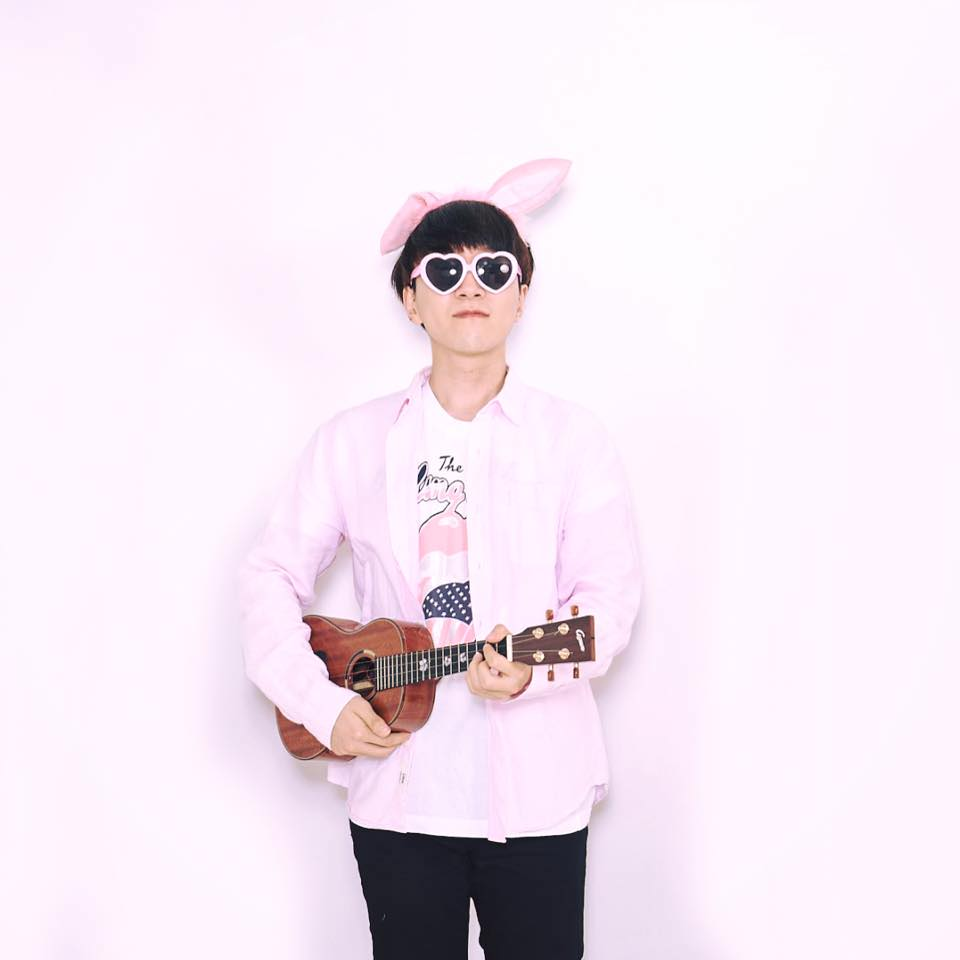

# Profile #

 

#### 최종호 (JONGHO CHOI)

Master's Student @ [Music and Audio Research Group(MARG)](http://marg.snu.ac.kr/) (2020 ~ )

:email: sweetcocoa@snu.ac.kr

 [github.com/sweetcocoa](https://github.com/sweetcocoa)

## Research Interests ##

- Deep Learning
- Music Recommendation
- Music Representation
- Music Transcription

## Education ##

 Sep 2020 - 

- 서울대학교 음악오디오 연구실(MARG) 석박통합과정
- **Master's Student** at Music and Audio Research Group(MARG), Seoul National University, Seoul, Korea.

 Mar 2013 - Aug 2020

- 서울대학교 전기정보공학부 학사과정, 연합전공 계산과학
- **BS** in Electrical and Computer Engineering, Seoul National University, Seoul, Korea.

Mar 2010 - Feb 2013

- 부산 건국고등학교
- KeonKuk High School, Busan, Korea.

## Career ## 

June 2020 - July 2020

- 카카오 추천팀 인턴
- Intern Researcher at Kakao Recoteam

Sep 2017 - Dec 2019

- 이스트소프트 A.I. PLUS Lab 연구원 (병역특례 산업기능요원)
- Research Engineer in ESTsoft A.I. PLUS Lab *(As Substitutional Military Service)* 

July 2016 - Sep 2017

- 개미집소프트 해외 데이터 팀 소프트웨어 개발자 (병역특례 산업기능요원)
- Software Engineer in GemizipSoft Financial Data Team *(As Substitutional Military Service)*

June 2015 - Aug 2015

- 한화테크윈 인턴 개발자
- Intern Engineer at Hanhwa Techwin

## Skills

-  Python
-  PyTorch

## Personal Projects ##

- **Cerberus** : Simultaneous Separation and Transcription of Mixtures with Multiple Polyphonic and Percussive Instruments [Github](https://github.com/sweetcocoa/cerberus-pytorch),  [Demo Video](https://youtu.be/59uTEk0ZamE) 
- **DDSP** : Differentiable Digital Signal Processing [Github](https://github.com/sweetcocoa/ddsp-pytorch), [Demo Page](http://sweetcocoa.github.io/ddsp-pytorch-samples) 
- Single-Image Super-Resolution with Iterative Kernel Correction [Github](https://github.com/sweetcocoa/IKC )
- **Deep Complex U-Net** for Speech Enhancement  [Github](https://github.com/sweetcocoa/DeepComplexUNetPyTorch )
- **Onsets and Frames** :: DL-Based Piano Transcription [Github(demo only)]( https://sweetcocoa.github.io/wav2midi_demo/ )
- **PinkBlack** :: PyTorch Training Code Templates [Github](https://github.com/sweetcocoa/PinkBlack)
- 우쿨코드북 :: Ukulele Chord book Android Application @ [Android PlayStore](https://play.google.com/store/apps/details?id=com.ukulchordbook.ukulchordbook_10)

## Projects ##

- GoG(Glasses on Glasses) : 안경 쓴 영상에서 안경 제거 @ ESTsoft.
- 딥러닝을 이용한 안경/선글라스 이미지검색 @ [ESTsoft](https://www.estsoft.co.kr/product/retrieval).
- 가상 안경/선글라스 착용 3D AR 렌더링 라이브러리 개발, 유지보수 @ [ESTsoft](https://www.estsoft.co.kr/product/vf).
- 딥러닝을 이용한 얼굴에 따른 안경/선글라스 추천 연구 @ ESTsoft.
- 멀티캐스트 네트워크를 이용한 해외 스프레드 거래 데이터 피딩 시스템 개발 @ GemizipSoft.

- 

- GoG(Glasses on Glasses) : Eyeglasses Removal from the video. @ ESTsoft.
- DL-based Glasses/Sunglasses Image Retrieval System @ [ESTsoft](https://www.estsoft.co.kr/product/retrieval).
- 3D AR Rendering Library for Wearing Eyeware on Face @ [ESTsoft](https://www.estsoft.co.kr/product/vf).
- Study of DL-based Eyeware Recommendation by Face @ ESTsoft.
- Development of Spread Transaction Data Feeding System Using Multicast Network @ GemizipSoft. 

## Awards ##

- *(Unofficial)* 과기정통부 주최 2018 인공지능 R&D 챌린지 : 합성사진 찾기 (3위 이내)

  > 비고 : 규정에 따른 코드 프리징 문제로 탈락

- (Official) 과기정통부 주최 2019 인공지능 R&D 그랜드 챌린지 : 청각인지 트랙 (8위) [(링크)](https://www.ai-challenge.kr/sub03/view/id/26)

- (Unofficial) Within 3rd place in 2018 AI R&D Challenge Hosted by the Ministry of Science and ICT (MSIT) - *Fake Image Classification*

  >  Note : Falled off Due to code freezing issues.
  
- (Official) 8th place in 2019 AI Grand Challenge Hosted by the Ministry of Science and ICT (MSIT) - *Auditory Track* [(Link)](https://www.ai-challenge.kr/sub03/view/id/26)

  

## Club Activities ##

- 서울대학교 딥러닝 학회 *Deepest* 3기 (2017 ~ )

  - 주요 활동

    > 딥러닝 세미나, 프로젝트, 해커톤 등

- 서울대학교 우쿨렐레 동아리 *ALKUL* 3기 (2013 ~ )

  - 주요 활동

    > 학내 정기 연주회
    >
    > [YouTube : Gypsy Ukulele↗](https://youtu.be/pCTypTc1XHQ)

- 서울대학교 컴퓨터 동아리 *SCSC* (2015 ~ 2017)

  - 주요 활동

    > 프로그래밍 강의, 딥러닝 스터디 등
